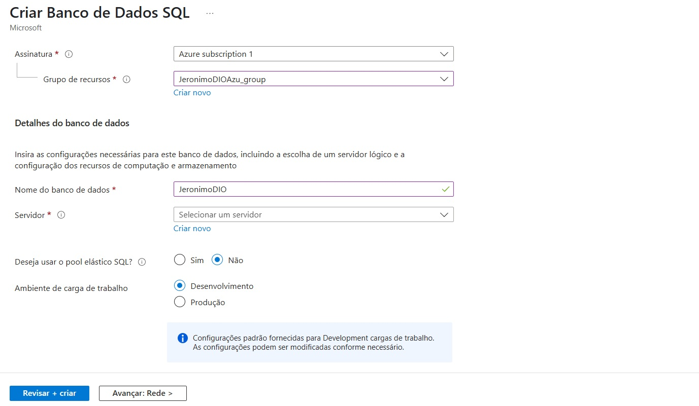
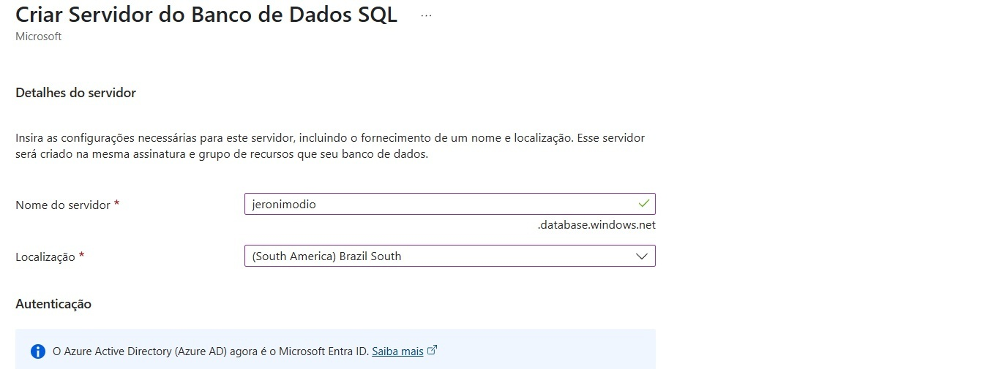
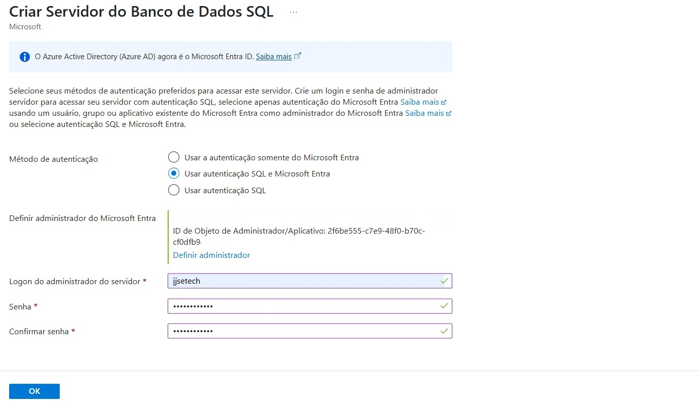
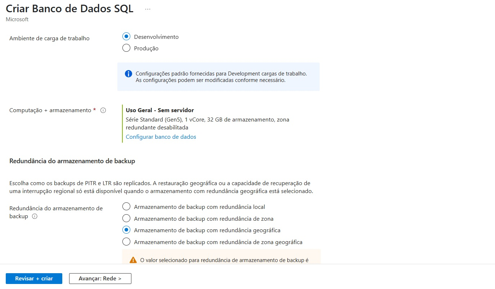

# Tutorial: Criando e Configurando uma Instância de Banco de Dados SQL no Microsoft Azure

Este tutorial apresenta o passo a passo para criar e configurar uma instância de Banco de Dados SQL na plataforma Microsoft Azure. Ideal para iniciantes que desejam compreender o processo de provisionamento de recursos no Azure.

## Pré-requisitos

Antes de começar, certifique-se de que você possui:
- Uma conta ativa no [Microsoft Azure](https://portal.azure.com/)
- Permissões para criar recursos no Azure (ex.: assinatura com nível de administrador)
- Acesso ao portal web do Azure

---

## 🚀 Passo a Passo

### 1. Acessar o Portal do Azure

- Acesse: [https://portal.azure.com](https://portal.azure.com)
- Faça login com sua conta da Microsoft.

---

### 2. Criar um Recurso de Banco de Dados SQL

1. No menu lateral esquerdo, clique em **"Criar um recurso"**.
2. Selecione **"Banco de Dados" > "SQL Database"**.
3. Clique em **"Criar"**.

---

### 3. Configurar a Instância

#### 3.1 Detalhes do Projeto
- **Assinatura:** Selecione a assinatura ativa.
- **Grupo de Recursos:** Crie um novo ou selecione um existente (ex.: `meu-grupo-bd`).

#### 3.2 Detalhes do Banco de Dados
- **Nome do Banco de Dados:** Escolha um nome único (ex.: `meubancoazure`).
- **Servidor:** Clique em **"Criar novo"**.
  - **Nome do servidor:** (ex.: `meuserverbd`)
  - **Login de administrador:** (ex.: `adminuser`)
  - **Senha:** Crie uma senha segura
  - **Localização:** Escolha a região mais próxima de você







#### 3.3 Configuração de Computação + Armazenamento
- Clique em **"Configurar banco de dados"**.
- Escolha um modelo básico (por exemplo, **DTU-based** - Basic) ou escolha **vCore** se quiser mais controle.
- Clique em **Aplicar**.



---

### 4. Políticas de Backup e Redundância

- Escolha a **redundância** de armazenamento adequada (locais, geograficamente redundantes, etc.).
- Configure as opções de **backup automático**, se necessário.

---

### 5. Configurações Adicionais

- Você pode importar um banco de dados existente (.bacpac) ou deixar como **"Sem fonte de dados"**.
- Marque se deseja habilitar o Azure Defender para SQL (recomendado para ambientes de produção).

---

### 6. Revisar e Criar

- Clique em **"Revisar + Criar"**.
- Revise todos os detalhes.
- Clique em **"Criar"** para provisionar o recurso.


---

## 🔒 Configurar Regras de Firewall

Após a criação:
1. Vá até o recurso do banco de dados SQL.
2. Clique em **"Configurações de firewall e redes virtuais"**.
3. Clique em **"Adicionar IP do cliente atual"** para permitir o acesso do seu computador.
4. Clique em **Salvar**.

---

## 🔗 Conectar ao Banco de Dados

Você pode se conectar usando:
- **SQL Server Management Studio (SSMS)**
- **Azure Data Studio**
- **String de conexão no seu app** (ex.: .NET, Python, Node.js)

**Exemplo de string de conexão (ADO.NET):**
```text
Server=tcp:meuserverbd.database.windows.net,1433;Initial Catalog=meubancoazure;Persist Security Info=False;User ID=adminuser;Password=suasenha;MultipleActiveResultSets=False;Encrypt=True;TrustServerCertificate=False;Connection Timeout=30;
```
---

## ✅ Dicas Finais
- Monitore o desempenho usando o Azure Monitor e SQL Insights.
- Lembre-se de aplicar boas práticas de segurança como:

  - Autenticação com Azure Active Directory
  - Acesso restrito por IP
  - Criptografia em trânsito e em repouso
